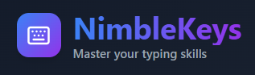
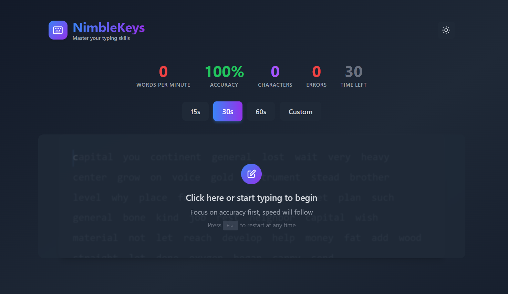

# NimbleKeys

<p align="center">
  
</p>

A modern, minimalist typing test inspired by MonkeyType. Sharpen your typing speed and accuracy with a clean, distraction-free interface.


<p align="center">
  
</p>

---

## ✨ Features

- **Minimalist, Modern UI**: Focused, distraction-free design.
- **Multiple Test Modes**: 15s, 30s, 60s, or custom durations (1s–5min).
- **Live Stats**: Real-time WPM, accuracy, character count, and error tracking.
- **Visual Feedback**: Color-coded letters—green for correct, red for mistakes.
- **Dark & Light Themes**: Toggle your preference, auto-saved.
- **Responsive**: Looks great on desktop, tablet, and mobile.
- **Smooth Animations**: Polished transitions and micro-interactions.
- **Keyboard Shortcuts**: Press `Esc` to restart the test instantly.
- **Privacy-First**: No data collection, everything runs locally.

---

## 🚀 Live Demo

Try it now: [NimbleKeys GitHub Pages](https://parthivkoli.github.io/NimbleKeys/)

---

## 🛠️ Tech Stack

- **Frontend**: React 18 + TypeScript
- **Styling**: Tailwind CSS
- **Icons**: Lucide React
- **Build**: Vite
- **Deployment**: GitHub Pages

---

## 📦 Installation

```bash
git clone https://github.com/Parthivkoli/NimbleKeys.git
cd NimbleKeys
npm install
npm run dev
```
Then open [http://localhost:5173](http://localhost:5173) in your browser.

---

## 🚀 Deployment

This project is set up for automatic deployment to GitHub Pages via GitHub Actions.  
Pushing to the `main` branch will build and deploy your site.

**Manual Deployment:**
```bash
npm run build
# Deploy the contents of the dist/ directory to your static host or GitHub Pages
```

---

## 🏗️ Production Build

```bash
npm run build
```
The production-ready files will be in the `dist` directory.

---

## 🎯 How to Use

1. **Choose a Mode**: 15s, 30s, 60s, or custom (up to 5min).
2. **Start Typing**: Click the text area or begin typing.
3. **Watch Accuracy**: Green = correct, Red = error.
4. **Monitor Stats**: Live WPM and accuracy update as you type.
5. **Restart**: Press `Esc` or click the restart button anytime.

---

## 🎨 Customization

- **Themes**: Toggle dark/light mode via the header. Your choice is remembered.
- **Test Duration**: Select a preset or set your own (1s–5min). Last used mode is remembered.

---

## 📊 Statistics Explained

- **WPM (Words Per Minute)**: 1 word = 5 characters
- **Accuracy**: Percentage of correctly typed characters
- **Characters**: Total typed
- **Errors**: Incorrect keystrokes
- **Time**: Time left in the test

---

## 🤝 Contributing

We welcome contributions!

1. Fork the repo
2. Create a feature branch: `git checkout -b feature/your-feature`
3. Commit and push: `git commit -m "Description"` → `git push origin feature/your-feature`
4. Open a Pull Request

**Guidelines:**
- Follow existing code style and conventions.
- Write meaningful commit messages.
- Test changes thoroughly.
- Update documentation if needed.

---

## 🐛 Bug Reports

Found a bug?  
Please [open an issue](https://github.com/Parthivkoli/NimbleKeys/issues) with:
- A clear description
- Steps to reproduce
- Expected vs. actual behavior
- Browser and device info

---

## 📝 License

MIT License. See [LICENSE](LICENSE) for details.

---

## 🙏 Acknowledgments

- Inspired by [MonkeyType](https://monkeytype.com)
- Built with modern open-source tools
- Thanks to the OSS community for making this possible

---

## 📞 Contact

- GitHub: [@Parthivkoli](https://github.com/Parthivkoli)

---

**Happy Typing!** 🎯✨